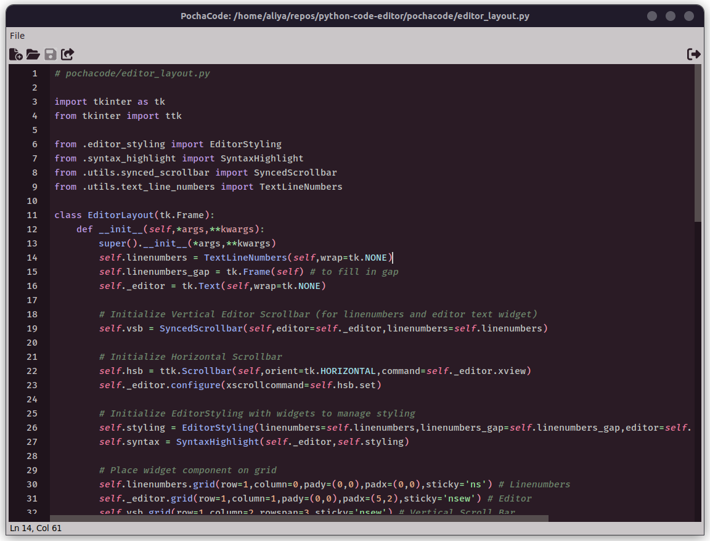

<a id="readme-top"></a> 
<!--<p align="right">(<a href="#readme-top">back to top</a>)</p>-->
<!-- 

Project Name:       PochaCode
Repository Name:    python-code-editor

-->

# PochaCode
A code editor for writing Python.

### Table of Contents
1. [About the Project](#about-the-project)
2. [Installation](#installation)
3. [Usage](#usage)
4. [License](#license)

## About the Project



This is a simple code editor written in Python, for Python. Currently, all it can do is write and display code. The main theme for the editors styling and syntax was created by me, however it will probably change.

### Built With

- Python
- Tkinter (Python GUI toolkit)

### Features

- Syntax highlighting (WIP)
- Line numbers (WIP)

### Planned Features

- File handling (New File, Open, Save, Save As)
- 'Status' bar on bottom of editor (Shows Lines #, Current Ln#Col#, Turn Off Syntax/Styling/Theme/Font, Screenshot, etc)
- Tabs for files
- Theme Selection

<p align="right">(<a href="#readme-top">back to top</a>)</p>

---

### Installation

#### 1. Requirements

- Python 3.2+
- Tkinter

#### 2. Clone the Repository:

- **Linux/MacOS**:
  ```bash
  # Unix Shell
  git clone https://github.com/aliya-gamez/python-code-editor.git
  cd python-code-editor
  ```

- **Windows**:
  ```bash
  # Git Bash
  git clone https://github.com/aliya-gamez/python-code-editor.git
  cd python-code-editor
  ```

#### 3. Install Tkinter (if not installed):
Only run these commands if you do not have tkinter installed.

- **Linux/MacOS**:
  ```bash
  sudo apt install python3-tk
  ```

- **Windows**:
  ```bash
  pip install tk
  ```

 <p align="right">(<a href="#readme-top">back to top</a>)</p>


---

### Usage

Download the editor, ```cd``` to where it was downloaded and then run it in console like this:

- **Linux/macOS**:
  ```bash
  # Run the application in shell
  python3 -m pochacode
  ```

- **Windows**:
  ```bash
  # Run the application in Command Prompt
  py -m pochacode
  ```

 <p align="right">(<a href="#readme-top">back to top</a>)</p>
 
---

### License

There is currently no license.

 <p align="right">(<a href="#readme-top">back to top</a>)</p>